<h1 align="center">基于Spring Boot 的社区物业管理系统【带论文】</h1>

- <b>完整代码获取地址：从戎源码网 ([https://armycodes.com/](https://armycodes.com/))</b>
- <b>技术探讨、资料分享，请加QQ群：692619798</b>
- <b>作者微信：19941326836  QQ：3645296857</b>
- <b>承接计算机毕业设计、Java毕业设计、Python毕业设计、深度学习、机器学习</b>
- <b>选题+开题报告+任务书+程序定制+安装调试+论文+答辩ppt 一条龙服务</b>
- <b>所有选题地址 ([https://github.com/Descartes007/allProject](https://github.com/Descartes007/allProject)) </b>

## 一、项目介绍

### 基于 Spring Boot 的社区物业管理系统，面向两类主要角色：后台管理员（运营/物业管理）与业主/用户（小区居民）。主要功能如下：
### 管理员（后台）：
- 基本：登录、修改密码、获取/修改个人信息、登出、会话管理
- 用户与权限：后台用户管理（增删改查、重置密码、在线/会话信息）
- 小区基础数据：字典管理、系统配置管理
- 房屋管理：房屋信息筛选/列表/详情/新增/修改/删除
- 停车管理：停车位信息的增删改查与批量导入
- 收费管理：收费记录增删改查、统计、导入/导出（与报表联动）
- 组织信息：组织机构 CRUD
- 文件管理：文件上传
### 业主 / 用户（前端）：
- 账号相关：注册、登录、登出、重置/忘记密码、获取 session 信息
### 个人信息：查看/编辑个人档案、上传头像（支持图片路径）
- 业务查看与操作：查看房屋信息、查看/查询缴费记录、提交/修改个人相关记录（受权限管控）

## 二、项目技术

- 编程语言：Java 1.8（后端）
- 架构：B/S 架构
- 后端技术：Spring Boot 2.2.2、Spring Web、MyBatis / MyBatis-Plus、Spring JDBCMySQL（JDBC 驱动），MyBatis 映射，FastJSON、Hutool、Apache Commons
- 前端技术：Vue 2 + Vue Router、Element UI（组件库）、Axios（HTTP）、、vue-quill-editor、vue-json-excel、vue-qr

## 三、运行环境

- JDK版本：1.8及以上都可以
- 操作系统：Windows7/10、MacOS
- 开发工具：IDEA、Ecplise、MyEclipse都可以

## 四、数据库配置文件

- npm版本：6.14.13及以上都可以
- Redis版本：3.2.100及以上都可以
- 文件名：application.yml
- 编码类型：utf8

## 论文截图

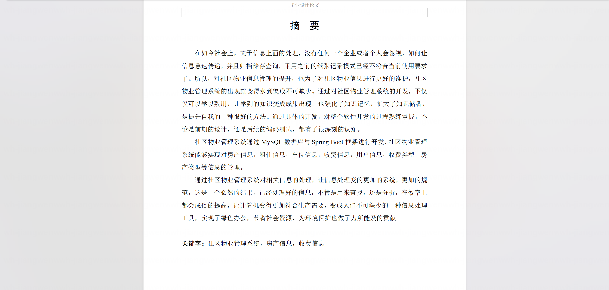

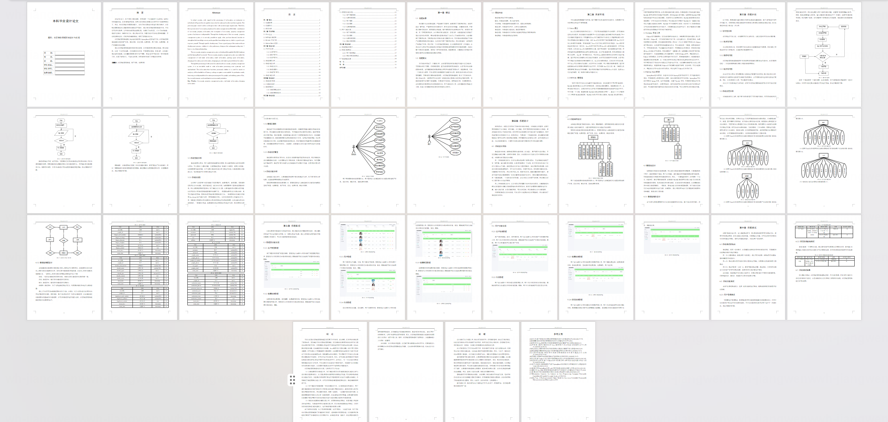

## 系统截图

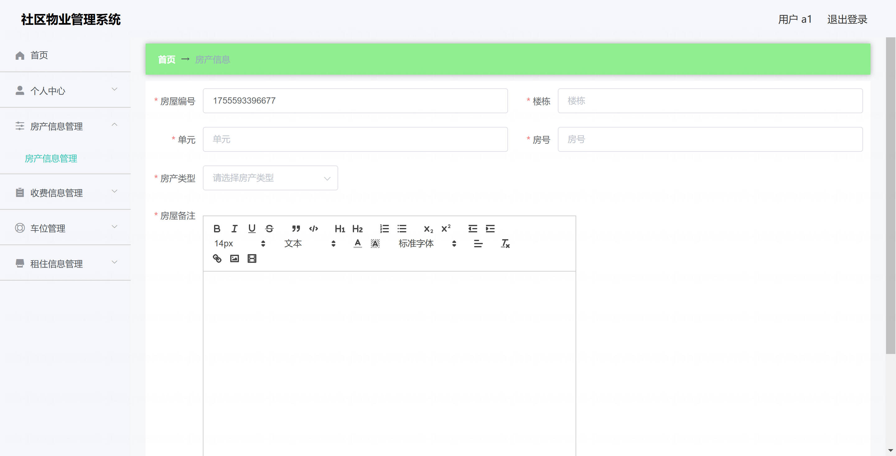

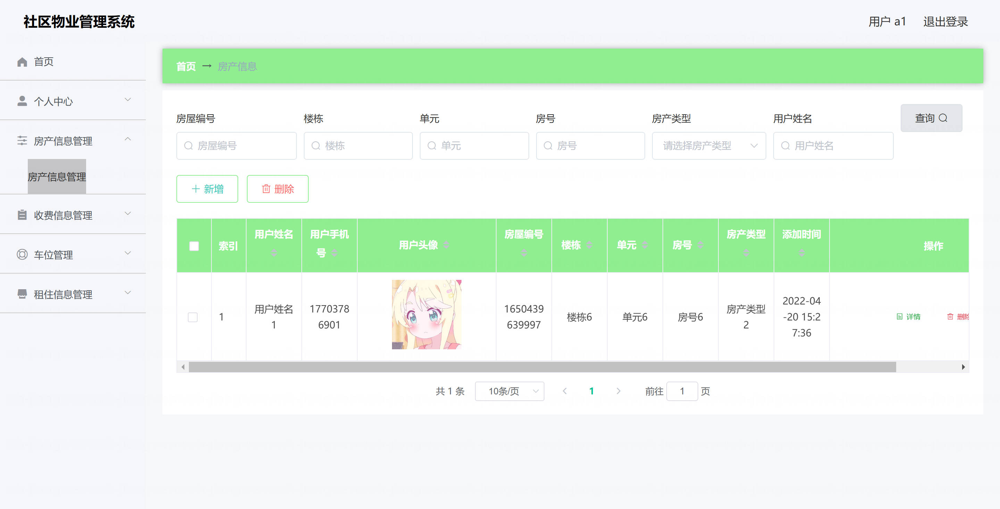

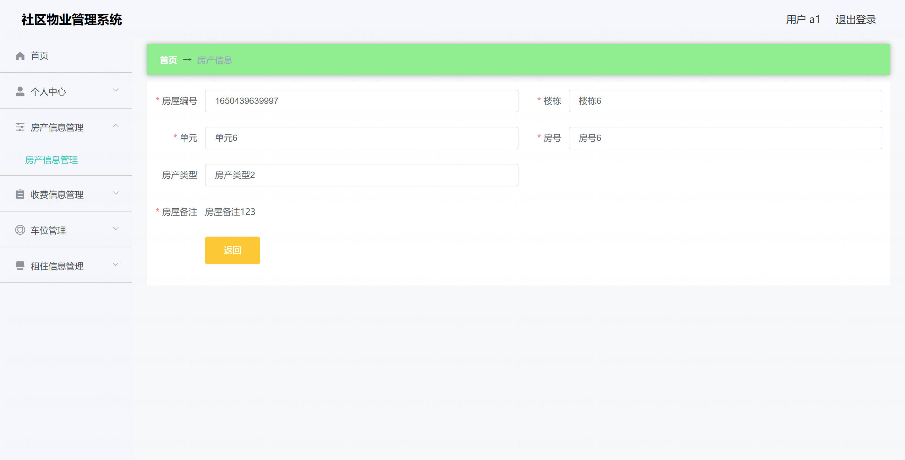

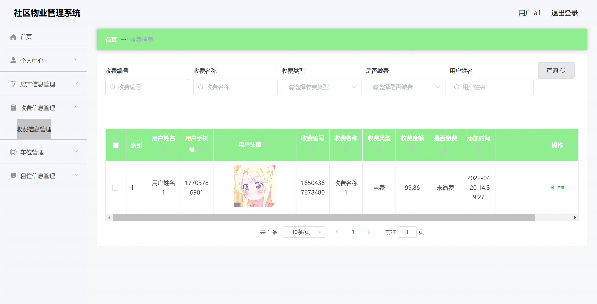

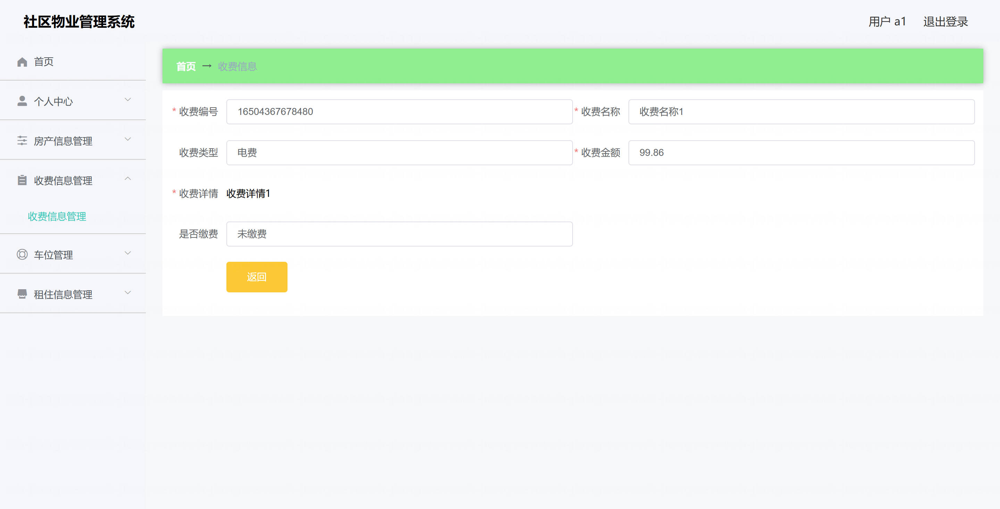

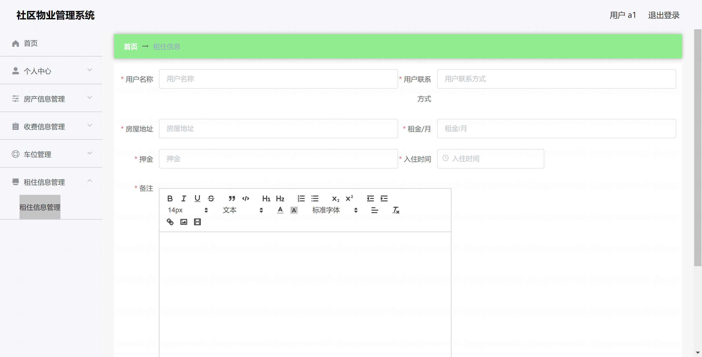

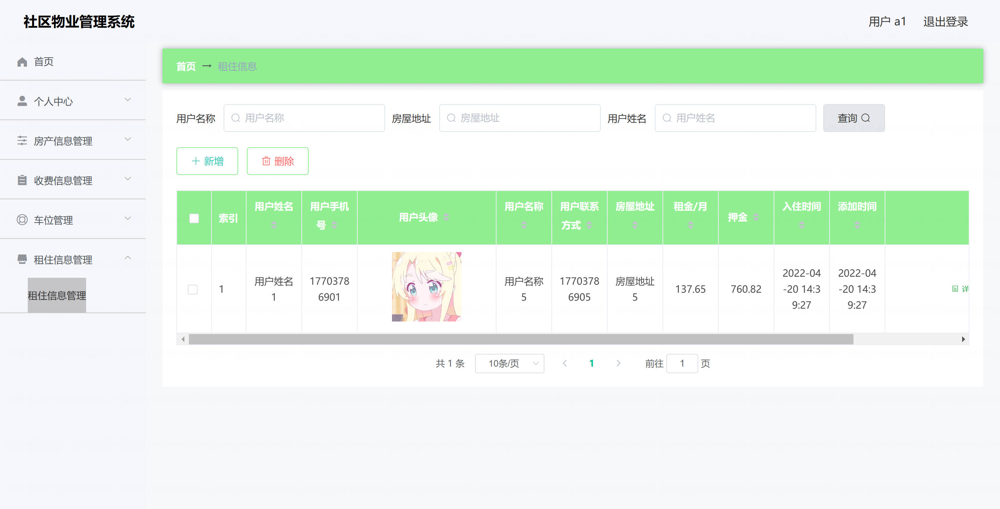

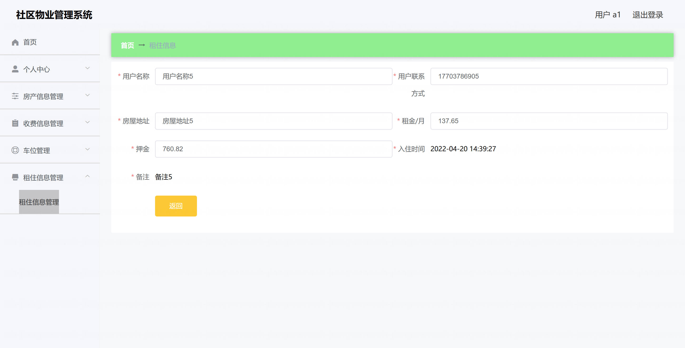

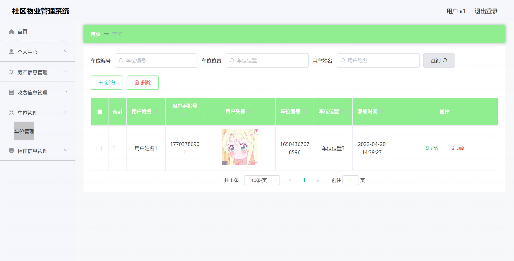